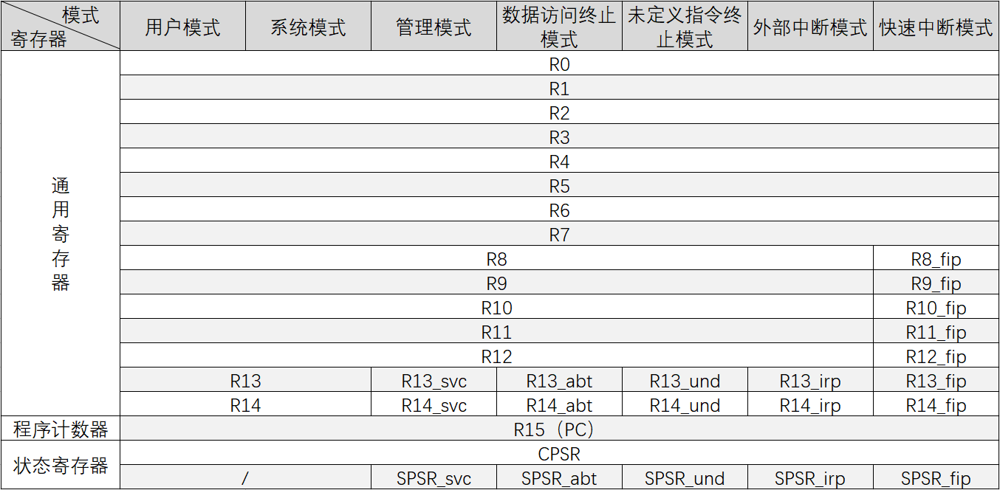

# 图片测试



# 表格测试

|地址|大端模式|小端模式|
|:--:|:--:|:--:|
0x00（低地址）|12（Byte_3）|78（Byte_0）
0x01 ↓|34（Byte_2）|56（Byte_1）
0x02 ↓|56（Byte_1）|34（Byte_2）
0x03（高地址）|78（Byte_0）|12（Byte_3）

# Tab表页样式设计

<!-- tabs:start -->

#### ** 未分组寄存器 **

在所有的运行模式下，未分组寄存器都指向同一个物理寄存器，它们未被系统用作特殊的用途，因此，在中断或异常处理进行运行模式转换时，由于不同的处理器运行模式均使用相同的物理寄存器，可能会造成寄存器中数据的破坏，这一点在进行程序设计时应引起注意。

#### ** 分组寄存器 **

#### R8~R12

对于分组寄存器，它们每一次所访问的物理寄存器与处理器当前的运行模式有关。
对于 **R8~R12** 来说，每个寄存器对应两个不同的物理理寄存器：

* 当使用 **fiq（快速中断模式）** 模式时，访问寄存器**R8_fiq~R12_fiq**；
* 当使用除fiq模式以外的**其他模式时**，访问寄存器**R8_usr~R12_usr**。

#### R13、R14

对于R13、R14来说，每个寄存器对应6个不同的物理寄存器，其中的一个是用户模式与系统模式共用，另外5个物理寄存器对应于其他5种不同的运行模式，采用以下的记号来区分不同的物理寄存器:

#### ** 程序计数器 **

**寄存器R15用作程序计数器(PC)**。
* 在ARM状态下，位[1:0]为0，位[31:2]用于保存PC；
* 在Thumb状态下，位[0]为0，位[31:1]用于保存PC。

R15**也可用作通用寄存器**，但一般不这么使用，因为对R15的使用有些特殊的限制，当违反了这些限制时，程序的执行结果是未知的。

由于ARM体系结构采用了多级流水线技术，对于ARM指令集而言，**PC总是指向当前指令的下两条指令的地址，即PC的值为当前指令的地址值加8个字节**。

<!-- tabs:end -->

# 代码块

### 立即寻址

```armasm
ADD R1, R1, #1234  ;R1 ← R1 + 1234
ADD R1, R1, #0x7f  ;R1 ← R1 + 0x7f
```